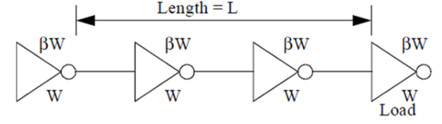
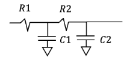

    
## Homework 5

### For all the problems, please use the following values where needed (based on 45 nm tech.)
 * $ \lambda = 0.0225 {\mu}m $
 * $ R_{sqp} = 26 kOhm/\square $
 * $ R_{sqn} = 12 kOhm/\square $
 * $ C_{gate} = 1.2 fF/{\mu}m$ of $W$
 * $ C_{d} = 1.2 fF/{\mu}m$ of $W$
 * $ V_{DD} = 1.0 V $
 * All the transistors have minimum length $2{\lambda}$
 * All the transistors have minimum width $4{\lambda}$

### The importance of floor-planning, wires and power delivery 

You are concerned about wire delay increasing quadratically with wire length. We learned in class that with proper repeater placement, delay of a wire can become linear with the length of that wire. Since you know that in order to drive a big gate/load, adding inverters along the path reduces the delay, you propose placing repreaters along the wire line. This problem will investigate the optimal number of repeaters and the optimal size for them. 

First we need an appropriate way to model a wire. Note that a wire is essentially a series of infintesimally small resistors and capacitors. However, to simplify our lives, we will use a model of the wire: We'll say that "on average" half the capacitance is at one end of the wire, while the other half is at the other end. This way of modeling a wire cap and resistance is called the "Pi Model", and it turns out that it is also a pretty accurate one. 

Let the wire have length $L$, capacitance per unit length $C_W$, and a resistance per unit length $R_w$. The inverters are sized for equal rise and fall time with p to n ratio of $\beta$. The transistor gate capacitance per $\mu m$ is $C_T$ and the equivalent resistance is $R_T \times \mu m$. (i.e., an inverter with an nMOS of width $W$ $\mu m$, will have $W(1+\beta)C_T$ of gate capacitance and an equal resistance of $R_T/W$ for pull-up and pull-down). The diffusion capacitance per $\mu m$ is $C_D$, and for our analysis, it is roughly equal to the gate cap. We break the entire wire into $N$ segments by inserting $N-1$ repeaters. The figure below hows an example line with $N=3$. We will assume that the final load capacitance is equal to the capacitance of a repeater (it keeps the problem symmetric). Here assume that the drive is also part of the repeater chain. Thus you can use $N$ in your calculations instead of $N-1$. 

 

Let's now zoom in to one segment of repeater and wire. You already know how to model an inveter - It has a driving resistance of $R_T / W$ and an intrinsic cap of $W(1+\beta)C_D$. We will use the "pi model" for our wire segment (not that in the diagram below, the wire segment is of one length). Finally, since we consider a repeater as our load, we can model it simply as $W(1+\beta)C_T$ of gate cap. Putting things together we get: 

 

Unfortunately this leads to a more complex $RC$ circuit than we have seen in EE271, since all the capacitance is NOT at the same place: at the end of the resistance. Here will have capacitance distributed in the circuit. To solve this problem one generally uses what is called the "Elmore Delay" (or the single time-constant approximation). Formally the Elmore delay for a node i: $\Tau_D_i = \sum_{k=1}^{n}R_{k,i}C_k$ where n is the number of nodes in the circuit and is the total resistance from $V_{DD}$/$GND$ at node k, which is also seen (i.e., shared) by node i. This is really more complex than we need in EE523 where the output, the node of interest is the last node in a chain. In this case the Elmore delay is simply the delay obtained by summing the delay you would get by adding the delay caused by each capacitor (ignoring all the rest). This delay is always a simple RC. So in the circuit shown below, the delay is $R1C1 + (R1+R2)C2$. 

1. Compute the total delay from driver to receiver as a function of $W$, $L$, $N$ and the physical parameters of the wires and gates ($R_W$, $C_W$, $R_T$, $C_T$, $\beta$).

2. Find $N$ which minimizes the delay (this does not depend on $W$) and then find $W$ which minimizes delay. 

3. Solve for the delay per micron of wire length in terms of ($R_W$, $C_W$, $R_T$, $C_T$, $\beta$). Ignore annoying little details like the fact that it is difficult to build a non-integer number of repeaters or that logic desigers may go ballistic if you insert an odd number of inversions late in the design process. 

4. Now, please substitute the universal transistor parameters to get a numeric answer. The $R_{sq}$ for an nMOS transistor is roughly 12K (note this is NOT $R_T$), transistor gate capacitance is $1.2fF/\mu m$, $\beta = 2$. For the wires, assume that the wire capacitance is $0.3fF/\mu m$, and the resistance is $0.03\ohm/\square$ and the wire width is $0.5\mu m$. Compute the optimal wire delay (ps/mm), wire length between repeaters (mm), and a size of each repeater ($\mu m$). What is the ratio between the speed of light $mm/ps$ in a medium with $\epsilon = 3.9$, and the speed you calculate? 

5. When designing the layout for the SRAM cells in HW1, you may have been tempted to use poly for routing the wordline/bitline/$V_{DD}$/$GND$. Armed with more knowledge about wires (lecture notes 3 and 7), why is that a bad idea? 