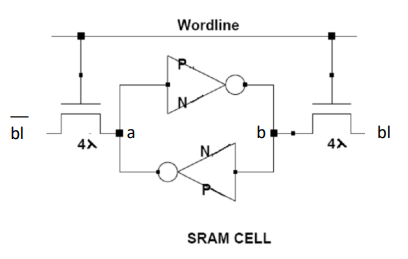

  - [Lab 1 Guidelines - 6T SRAM Cell](Lab1.pdf)
  
## Introduction
An SRAM cell is a basic memory element that consists of two cross-coupled inverters. Due to its high
speed and small footprint, it is used as the core of most logic memory structures, including processor
caches. The gate level schematic of this cell is given in Figure 1.

**Figure 1. Gate level schematic of an SRAM Cell**

## SRAM Operation

The operation of an SRAM cell is a little tricky because it only has **one control line** (the **wordline**) that is used for both reading and writing. The key insight is:

- A **0 (low voltage)** on a bitline can **overpower** a stored high voltage in the cell.  
- A **1 (high voltage)** on a bitline will **not overpower** a stored low voltage in the cell.  

---

### Writing
- **Write 0**: pull **bl** to GND.  
- **Write 1**: pull **𝑏𝑙̅** to GND.  

For example, to write a **1**:
1. Pull the **wordline** high.  
2. Drive **𝑏𝑙̅** to GND and **bl** to VDD.  
3. The drive strength on **𝑏𝑙̅** overpowers the charge stored on node *a* and the pMOS load, pulling node *a* low.  
4. This flips the cross-coupled inverter pair, leaving node *a* at `0` and node *b* at `1`.  
5. The wordline is dropped low, leaving the value latched in the cell.  

---

### Reading
1. Precharge **bl** and **𝑏𝑙̅** high, then leave them floating.  
2. Pull the **wordline** high.  
3. Depending on whether node *a* is `0` or `1`, one of the bitlines (**bl** or **𝑏𝑙̅**) will be pulled low by the inverters.  
4. The differential sense amplifier detects which line dropped, and thus the stored value.  

In a large memory, SRAM cells are arrayed into a rectangle, with several cells sharing every wordline,
and bitline. A sample 3x3 SRAM memory array is shown in Figure 2. Since most memories have a large
number of cells, memory designers spend tons of time trying to make the memory cell small. They
usually have a different set of design rules for memory cells to allow them to cheat to make the cells
smaller. In this problem, you will complete a stick diagram of an SRAM cell and of the 3x3 array