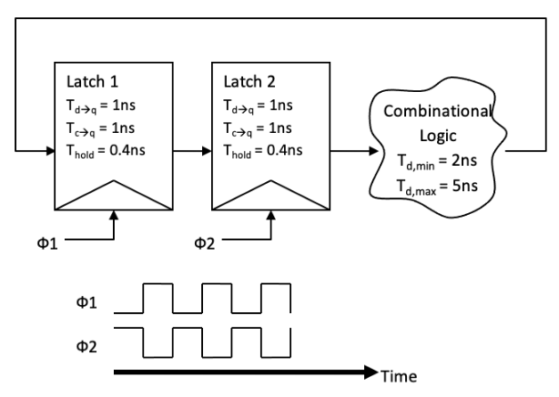

    
## Homework 4 

### For all the problems, please use the following values where needed (based on 45 nm tech.)
 * $ \lambda = 0.0225 {\mu}m $
 * $ R_{sqp} = 26 kOhm/\square $
 * $ R_{sqn} = 12 kOhm/\square $
 * $ C_{gate} = 1.2 fF/{\mu}m$ of $W$
 * $ C_{d} = 1.2 fF/{\mu}m$ of $W$
 * $ V_{DD} = 1.0 V $
 * All the transistors have minimum length $2{\lambda}$
 * All the transistors have minimum width $4{\lambda}$

### 1. Timing Constraints - edge-triggered Flip-Flops

 The figure below shows a system containing two edge-triggered flops and some combinational logic connecting the two flops. The flops have the following charactersistics: 

  * Setup time: 0.5ns
  * Clock-to-Q delay: 0.8ns
  * Hold time: 0.4ns

 

 A. Assuming no clock skew, what is the minimum clock period?

 B. Assume the clock period is set to the value calculated in part 5.1. For each of the following, explain whether the system could still work, and if it doesn't work, what could we do to the clock period to make it work? 

 I. The clock arrives 1ns late to flop 2. 

 II. The clock arrives 1ns early to flop 2. 

 III. The clock arrives 3ns early to flop 2. 

### 2. Timing Constraints - Two Phase Latches

The figure below depicts a sequential circuit with two latches and some combinational logic in-between. The two latches are clocked with $\phi 1$ and $\phi 2$ as shown, and $\phi 2$ = $INV(\phi 1)$.

 

### 3. Time borrowing (Weste and Harris 7.9)

For the diagram in the figure below, determine which latches borrow time and if any setup violations occur. Calculate for cycle times of 1200, 1000, and 800 ps. Assume there is zero clock skew and that the latch delays (i.e., $t_{setup}, t_{ccq}, t_{dcq}) are accounted for in the propagation delays. 

A. $\triangle 1$ = 550ps; $\triangle 2$ = 580 ps; $\triangle 3$ = 450 ps; $\triangle 4$ = 200ps;

B. $\triangle 1$ = 300ps; $\triangle 2$ = 600 ps; $\triangle 3$ = 400 ps; $\triangle 4$ = 550ps;

 
