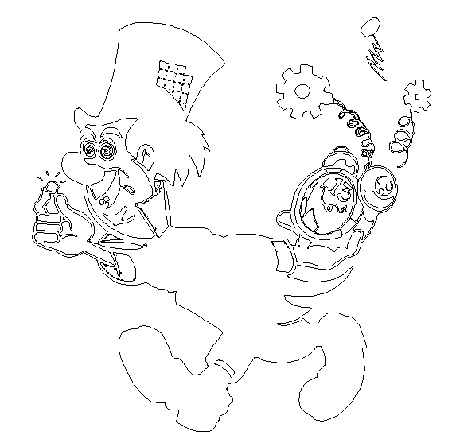

# Micro Fabrication Work 

## DXF design for Wafer Pattern Mask 

I wanted to do something a little tongue-and-cheek and counter culture, since the fab has so many safety rules, protocols, and operations manuals for the machines. It seemed fun to do something a little psychedelic and 70s, given the diffraction patterns on the wafers, so for my wafer photoresist mask, I chose to do the Acid-head Mad Hatter!

To view the DXF file, please download the following: 
[Mad Hatter Wafer Mask DXF](mad_hatter.dxf)

