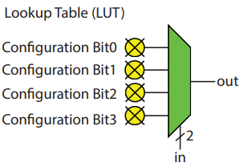
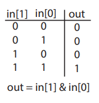
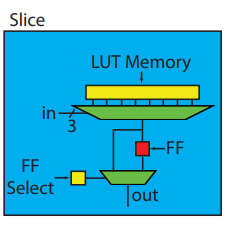

---
title: Intro to HLS
parent: CPE 400
nav_order: 1
has_children: true
--- 

# Intro to High Level Synthesis 

As hardware design process has evolved, many things have changed. Everything used to be done manually, until the ability to manufacture greatly increased, and hardware designers started relying on EDA (electronic design automation tools) 

Mead and Conway developed the programming language approach (VHDL/Verilog) which took hold in the 80s. As hardware increases in complexity at an exponential rate, hardware designers need even more abstract hardware programming language tools. 

RTL enabled designer to specify register and operations being implemented, and now EDA tolls can translate RTL specs into a digital circuit model and generate the files to make a manufacturable device or files necessary to program an FPGA. 

HLS is just another step in the abstraction, an it enables the designer to focus on the larger architectural questions, rather than individual register and cycle-cycle operations. 

**Note**: many commercial tools use C/C++ as the input language. 

## Fundamentals 

### **Algorithmic HLS**:

does several things automatically that an RTL designer does manually: 

 - analyzes and exploits concurrency in an algorithm 
 - inserts register as necessary to limit critical path and achieve a desired clock frequency 
 - generates control logic that directs the data path 
 - implements interfaces to connect to the rest of the system 
 - maps data onto storage elements to balance resource usage and bandwidth 
 - maps computation onto logic elements performing user specified and automatic optimizations to achieve the most efficient implementation 

**Note**: goal of HLS is to make decisions automatically based on user-provided input specifications and design constraints. But HLS tools differ greatly in ability to do this well. 

List of mature HLS tools: 
 - Xilinx Vitis HLS
 - LegUp
 - Mentor Catapult HLS 

## General Flow
 - Using Vitis HLS, we provide the HLS tool a functional specification, describe the interface, provide a target computational device, and give optimization directives. 

 - Specifically, Vitis HLS requires the following inputs: 
    - a function specified in C, C++, or SystemC
    - a design testbench that calls the function and verifies its correctness by checking the results. 
    - a target FPGA device 
    - the desired clock period 
    - directives guiding the implementation process 
 - In general, HLS tools cannot handles arbitrary software code: 
    - many concepts in software are hard to implement in hardware. Yet hardware description offers much more flexibility in terms of how to implement the computations 
 - Additional information is added using #pragmas that provide hints to the tools about how to create the most efficient designs. 

### 1. Input Function Specification:
 - No dynamic memory allocation ( malloc(), free(), new, and delete()) 
 - limited use of pointers to pointers (not at interface) 
 - system calls are not supported 
 - limited use of standard libraries (math.h supported) 
 - no recursive function calls 
 - interface must be precisely defined 

### 2. Primary Output of Vitis HLS 
 - Synthesizable Verilog and VHDL 
 - RTL simulations based on the design testbench 
 - Static analysis of performance and resource usage 
 - metadata at boundaries of design (easy to integrate) 

### 3. RTL design flow 
 - once RTL-level design is available, other tools used 
 - Using Xilinx Vivado Design Suite, logic synthesis is performed, translating the RTL-level design into a netlist of primitive FPGA logical elements. 
- The netlist (consisting of logical elements and the connections between them) is then associated with specific resources in a target device, called Place and Route (PnR). 
- The configuration of the FPGA resources is put in a bitstream, which can be loaded onto the FPGA to program its functionality. The bitstream contains a binary representation of the configuration of each FGPA resource
    - wire connections 
    - on chip memories 
    - logic elemnts 

## FPGA Architecture 

Modern FPGA architectures are geared for HLS optimizations.

FPGAs started from small arrays of programmable logic and interconnect to massive arrays of programmable logic and interconnect with on-chip memories, custom data paths, high speed I/O, and microprocessor cores all co-located on the same chip. 

## Architectural Features Relevant to HLS 

FPGAS are an array of programmable logic blocks and memory elements connected using a programmable interconnect. 

Logic blocks are implemented as a LUT, a memory where the address signals are the inputs and the outputs are stored in the memory entries. An n-bit LUT can be programmed to compute any n-input Boolean function by using the function's truth table as the values of the LUT memory.

### 2-input LUT (2-LUT) 

 

  Each of the four bits is configured to choose the function of the LUT, makint it a fully programmable 2 input logic gate. 

### Sample programming for AND gate 

 

  Values in "out" column correspond to the config bits 0 through 3. 

### Simple slice (9 config bits)

 

   - eight config bits for programming the LUT 
   - one bit to decide if input is combinational or flopped 
   - FF is basic memory element and co-located with LUTs 

**Def: Slice (noun)** - a small number of LUTs and FFs combined with routing logic (multiplexers) to move inputs, outputs, and internal value between the LUTs and FFs (Powerful programmable logic element)

**note**: exact number and size of LUTs, FFs, and MUXs varies by architecture. 

 3. Simple slice that contains a more complex 3-LUT  

### Glossary 

 - EDA: Electronic Design Automation (tools) 
 - HLS: High Level Synthesis 
 - RTL: Register Transfer Level 
 - LUT: Look-Up Table
 - FF: one-bit storage element 
 - Slice: small number of LUTs and FFs with routing logic 
 