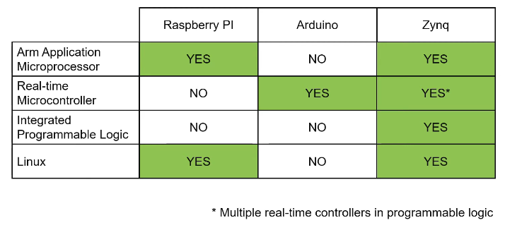

---
title: Intro to PYNQ
parent: CPE 400
nav_order: 2
has_children: true
--- 

# Intro to PYNQ

## Evolution of Development 

 - bit banging micro controllers (programmer works at bit level) 
 - Rasberry Pi - ARM microprocessor that runs Desktop Linux. It is native, meaning that it is not cross-compiled or cross-debugged. 
 - FPGA - parallel programmable logic 

### Zynq - Integrating microprocessors, microcontrollers, and programmable logic 

**System-on-Chip (SOC)**: 
Zynq platforms implement 
 - ARM microprocessors 
 - Programmable logic (FPGA) 
 - High-speed programmable IO 
 - 'soft' microcontrollers if needed 
 - fast connection between components 

 

### Use Cases 
 - Automotive 
 - Industrial Control 
 - High Performance Drones 
 - Vision Processing 
 - AI 
 - Medical Instrumentation 
 - Robotics 

(a.k.a acceleration of algorithms) 

 - lots of ways to learn with this one 

## PYNQ-Z2: Zynq development board 

 [PYNQ Explanation](https://pynq.io) 

 [PYNQ Documentation](https://pynq.readthedocs.org) 

 [Xilinx PYNQ Github](https://www.github.com/Xilinx/PYNQ) 

### Features 

 - Zynq 7020 
 - 512MB DDR 
 - Ethernet 
 - SD card 
 - LEDs, buttons, switches 
 - 2x Pmods 
 - Arduino and RaspberryPi headers 
 - HDMI In/Out 
 - USB 
 - Audio 

## PS and PL 

PS = Processing System 
 - Linux 
 - can connect using: screen /dev/ttyUSB1 115200 8N1 
 - USB HID 
 - 

PL = Programmable Logic 

 - LEDs, buttons, switches 
 - PYNQ Packages: 
  - pynq.lib.led
  - pynq.lib.rgbled 
  - pynq.lib.button 
  - pynq.lib.switch 
  - pynq.lib.pmod 
 
 - Arduino Header 
 - Raspberry Pi pins (8 shared with PMODA) 

 - pynq.gpio 
 - pynq.lib.video 
 - use 720P 

 - pynq.lib.audio 
 - speakers can be connected 
 
### What is PYNQ? 

 - open-source project from AMD that provides a  Jupyter-based framework with Python APIs for using AMD Xilinx Adaptive Computing platforms. 

 - PYNQ enables people to use Adaptive Computing platforms without using ASIC/FPGA tools. 

### Overlays 

 - in PYNQ, programmable logic circuits are represented as hardware libraries called overlays. These overlays are analogous to software libraries. 

 - Overlay can be accessed via Python API. 

 - Creating a new overlay requires knowledge in programmable logic (HDL). 

 - build once, re-use many times 

