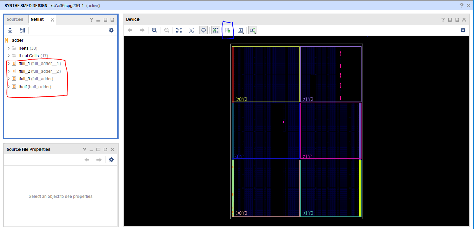

---
title: CPE 426 Lab 1
parent: CPE 426 Labs
nav_order: 1
--- 

# Lab 1 - PUF 

Please submit your lab as an archive file containing your project and your PDF write up.


[sample code zip](Lab1_Provided_Code.zip) 

[7-series CLB Documentation](ug474_7Series_CLB.pdf) 

Reference Papers:

1. [An Analysis of Ring Oscillators](analysis_of_ring_oscillators.pdf) 

2. [Improved Ring Oscillator PUF on FPGA](improved_puf.pdf) 

3. [Xin et. al](xin.pdf)

## Purpose 
This lab will go over how to design and implement hardware specifically designed for security 

## Introduction
Ring-Oscillator based PUFs are among the most common Strong PUFS for FPGAs. There are many implementations with various benefits. Below are three papers which outline FPGA PUFs implemented using various forms of Ring-Oscillators.

 * “An analysis of Ring Oscillator PUF Behavior on FPGAs”, by Eiroa and Baturone 

 * “Improved Ring Oscillator PUF: An FPGA-friendly Secure Primitive”, by Maiti and Schaumont 

 * “A Configurable Ring-Oscillator-Based PUF for Xilinx FPGAs”, by Xin, Kaps, and Gaj 

These papers build on each other and should optimally be read in order. For this lab you will be implementing a design very similar to the one described by Xin et al. in the third paper. Note that there will be differences between your design and the one presented in Xin et al!

## Lab Deliverables 

1. A demonstration of your initial blinking LED based upon a ring oscilator 

2. A demonstration of your working PUF. 

3. A demonstration of the fully working design, including hashing. 

4. A submitted archive (zip, tar, 7z) of your project. 

5. A write-up of your results, including:

    1. An answer to all questions in the lab (these will be in italics) 

    2. A description of approaches taken, problems encountered, and techniques used to overcome these challenges. 

    3. An analysis of the behavior of your produced design on three different locations on the FPGA. 
    
        A. In your original configuration, you should see that challenges with low hamming distance end up producing the same or similar responses. Find 5 challenges that give very different responses in this original configuration. 

        B. Document the output of the PUF across all these 5 challenges in each of the three configurations and determine the average hamming distance between the responses for the three locations.

## PUF Design
You will be implementing a modified version of the PUF described by Xin, Kaps, and Gaj. Your PUF should accept a 6-bit challenge.

### Sub Task 1
The paper describes two new methods used to generate a ring-oscillator based PUF. The first is to develop a different configurable ring-oscillator (Figure 6). Your ROs should also use KEEP and S attributes to avoid signal optimization (see potential problems). Design and implement your own configurable ring-oscillator using these requirements.

Connect this Ring Oscillator to the counter and max compare circuit shown in Figure 7. Use this to blink and LED on the Basys board at a rate of once per second. Demonstrate your blinking LED and code to the professor.

Question 1: What did you change about the provided configurable ring-oscillator?

### Sub Task 2 
Once you have completed the configurable ring-oscillator design and implement the PUF described in the paper in Figure 7. Ensure that there is a way to determine from outside the module if the response is complete.

Question 2: How many ROs are necessary?

Question 3: Why will a 50 MHz clock work for this design?

Question 4: Would any arbitrary clock speed work for this design?

Question 5: What did you decide to use for the max value of std_counter?

Question 6: How does this value impact the PUF?

Question 7: Why would we want to know if the challenge response is complete? 

### Sub Task 3
Now that you should have a working PUF implement a whole PUF on the BASYS 3 with the following input/output scheme.

Switches 0 through 5 should be the challenge bits.
The bits of the response are displayed on LEDs 0 through 7.
Once the challenge response is complete light LED 14
The seven-segment display shows the challenge byte concatenated with the response bits. (This can be accomplished using the provided sseg_des module)
Anytime any of the input bits are changed the challenge response is re-calculated
If the middle button is pressed the challenge response recalculates
Once you have completed this step, test that a challenge $$C_i$$ always produces the same response $$ CR_i $$ even across many separate calculations.

### Sub Task 4 
Now that you have a working PUF, incorporate the included SHA128 algorithm onto the board. (Note that once you add the SHA128 module, the implementation time is going to increase dramatically) It should be implemented as follows:

The input to the SHA hash should be the challenge concatenated with the response.
Note that the provided function automatically deals with padding.
Ensure that anytime the challenge or challenge response change the hash is updated.
When the hash is completed turn on LED 15.
When switches 12 through 15 are all low the seven-segment display continues to display the challenge and response concatenation as before.
When any of the switches 12 through 15 are on, the input on these four switches should be decoded and the corresponding two bytes displayed on the seven-segment display.
If the four switches are “0110” this decodes to 6 so the 6th pair of bytes (bytes 11 and 12) are displayed.
If the four switch bits decode to a number greater than 8 then display all zeroes.
Question 8: What is the purpose of this (why might we want to hash the challenge concatenated with the response)?

Finally, using the instructions provided in “Using Vivado pblocks to Adjust the Location of the Components” generate 3 constraint files which each specify a different location for the ROs. (Note that because of the long compile time it might be useful to develop several constraint files and implement them simultaneously, see “Potential Problems” for more details) Once you have three working PUFs with ROs in three different locations record the challenge-response pairs and analyze them.

Question 9: Are the challenge-response pairs the same for each location?

Question 10: Should they be (include details)?

Question 11: What are the intra-board and inter-board hamming distances?

Question 12: What are ideal?

Question 13: Discuss anything of note about your particular implementation or results. 

### Provided HDL

*sseg_des* 

This module is uused to output two butes to the seven-segment display. 

Inputs: 

 1. COUNT – The two bytes to display 
 
 2. CLK – A 100 MHz clock  
 
 3. VALID – ‘1’ If the input data is valid, ‘0’ otherwise 

See the comment block in the module for more details.

*sha128_simple* 

This is the provided module which performs a SHA128 hash on a given 16 bits of data. This implementation is a SHA256 using the last 128 bits as output. 

Inputs: 

 1. CLK – Clock input (tested up to 100 MHz) 
 
 2. DATA_IN – The 16 bits of data to run through the SHA hash. 

 3. RESET – Resets the HASH without generating a new hash (Must be high for at least one clock cycle) 

 4. START – Resets the HASH and starts a new hash (Must be high for at least one clock cycle, but no more than 16) 

Outputs:

 1. READY – ‘1’ when the last HASH was complete, and the module is ready to accept a new value to HASH 

 2. DATA_OUT – The 128 output bits 

### Potential Problems 

Here is a list of potential problems you will encounter during the process and a brief description of their solutions. Take into consideration that this is by no means a complete list. 

### VHDL Optimization 
Xilinx Vivado works very hard to optimize the VHDL you write. However, there are some instances were this can become an annoyance. This will almost certainly happen during the creation of your ring-oscillators in order to prevent this we can use Xlinix attributes. The attributes we will use are the KEEP and SAVE (S) attributes. The KEEP attribute preserves signals in the netlist. The SAVE attribute prevents nets from being absorbed into logic blocks and prevents related LUT from being optimized away. (For more details on attributes in Xilinx see the Xilinx XST User Guide)

Below is an example of how the attributes could be applied to a signal called “sig”. 

```
attribute KEEP : string; 

attribute S : string; 

signal sig : STD_LOGIC_VECTOR(3 downto 0) := "0000"; 

attribute KEEP of sig : signal is "True"; 

attribute S of sig : signal is "True";  

``` 

### Combinatorial Loops 
Vivado will not allow combinatorial loops within the nets. In order to allow this the following line must be added to the constraint file for each net containing a combinatorial loop.

set_property ALLOW_COMBINATORIAL_LOOPS true [get_nets {last_signal_in_loop}]

The last signal in the loop can occasionally be difficult to determine, however if the implementation is run without this line in the constraints file the error will tell you what this value should be. 

### Using Vivado pblocks to adjust the location of the components Synthesize and Implement your working design 

1. Synthesize and Implement your working design 

2. Open the Implemented Design 

    A. On the “Design” page there are blue spots. These are resources used by the design

     

    B. On the left are the nets and components of the implemented design 
    
    C. You can highlight a particular component by left clicking on it 

    D. Zoom in on the component you are going to be placing and analyze the resources is uses 

3. Open the Synthesized Design 

    A. On the left are the nets and components of the synthesized design 

    B. Right-Click on the component you are going to be placing and select Draw Pblock 

    C. Draw a Pblock, if the rectangles selected don’t contain any valid sites you will receive an error. 

    D. Name the pblock 

    E. Save 

        1. Note this will add to your constraints file 
        
        2. It is likely best to save to a new constraint file so the working contraint file is not overwritten 

4. Rereun the synthesis and implementation. 

5. Verify the implementation has changed so the component is now where the pblock you selected was. 

### Final Lab Questions 

*1. How difficult would it be to expand the number of challenge bits and the bits of the response? Describe the process and any considerations needed to ensure the PUF functions correctly. *  

*2. How might variations in temperature and voltage of the chip effect PUF? Think both raw entropy and the result of the hash. What are some methods which could mitigate the effect? * 

*3. You might have noticed in the paper and in our implementation the hamming distance between adjacent challenges is fairly minimal (15% in Xin et. Al). What might cause this? Can you think of a way of changing how we use the counter output to increase the hamming distance? Hint: This might mean reducing the number of usable response bits. *

*4. How could this implementation be modified on a board so that it could be verified from an external source and ensure freshness? (Don’t think about the BASYS 3 board, instead consider the fundamental structure of the device, including generic inputs and outputs) *